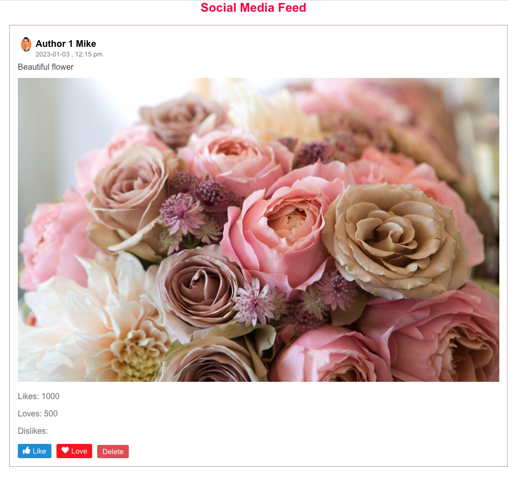
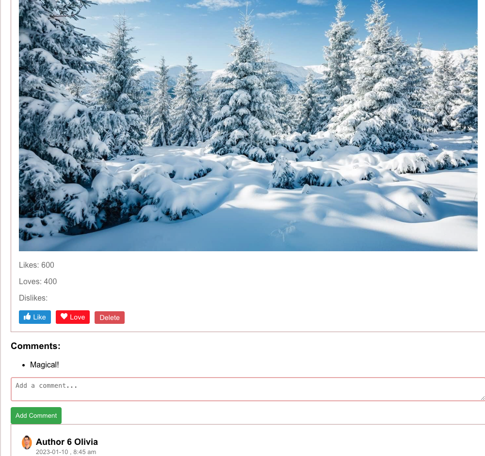

<!DOCTYPE html>
<html lang="en">

<head>
    <meta charset="UTF-8">
    <meta name="viewport" content="width=device-width, initial-scale=1.0">
    <title>Blog-App</title>
    

</head>

<body>

    <h1>Your Project Name</h1>

    
Brief description of your project.

    <h2>Table of Contents</h2>
    <ul>
        <li><a href="#introduction">Introduction</a></li>
        <li><a href="#features">Features</a></li>
        <li><a href="#prerequisites">Prerequisites</a></li>
        <li><a href="#installation">Installation</a></li>
        <li><a href="#usage">Usage</a></li>
        <li><a href="#screenshots">Screenshots</a></li>
        <li><a href="#project-structure">Project Structure</a></li>
        <li><a href="#contributing">Contributing</a></li>
        <li><a href="#license">License</a></li>

    </ul>

    <h2 id="introduction">Introduction</h2>

    
Explain what your project does and what problem it solves. Include any relevant context or background information.

    <h2 id="features">Features</h2>

    
List the key features of your project. For example:

    <ul>
        <li>Like, comment, and love react to photos</li>
        <li>Fetch photos from a JSON server</li>
    </ul>

    <h2 id="prerequisites">Prerequisites</h2>

    
Before you begin, ensure you have the following prerequisites:

    <ul>
        <li><strong>VSCode Clone:</strong> Set up a VSCode clone on your machine. You can find the official repository and installation instructions [here](link-to-your-VSCode-clone).</li>
        <li><strong>Node.js and npm:</strong> Make sure Node.js and npm are installed on your machine. You can download them from [here](https://nodejs.org/).</li>
    </ul>

    <h2 id="installation">Installation</h2>

    
Follow these steps to install and run the project:

    <pre>
        <code>
            # Clone the repository
            git clone https://github.com/sumeepokharel/blogapp.git

            # Install dependencies
            npm install
        </code>
    </pre>

    <h3 id="running-the-server">Running the Server</h3>

    <pre>
        <code>
            npm run server
        </code>
    </pre>

    <h3 id="accessing-the-application">Accessing the Application</h3>

    <pre>
        <code>
            npm run start
        </code>
    </pre>

    <h2 id="screenshots">Screenshots</h2>

    <h2 id="contributing">Contributing</h2>

    
Contributions to this project are welcome. If you find any bugs or have suggestions for improvement, please open an issue or create a pull request.

    <h2 id="license">License</h2>

    
This project is licensed under the MIT License.

</body>

</html>
